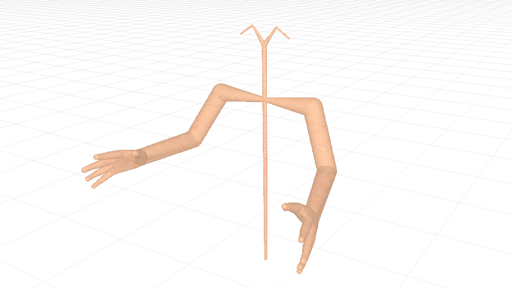
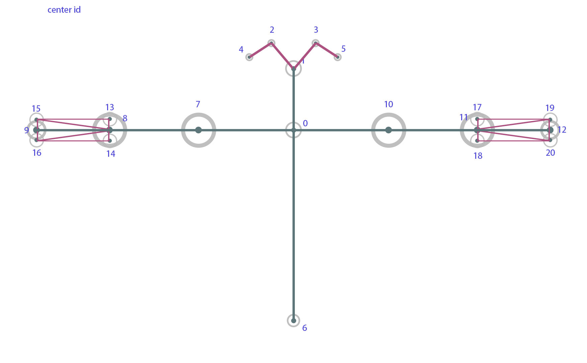
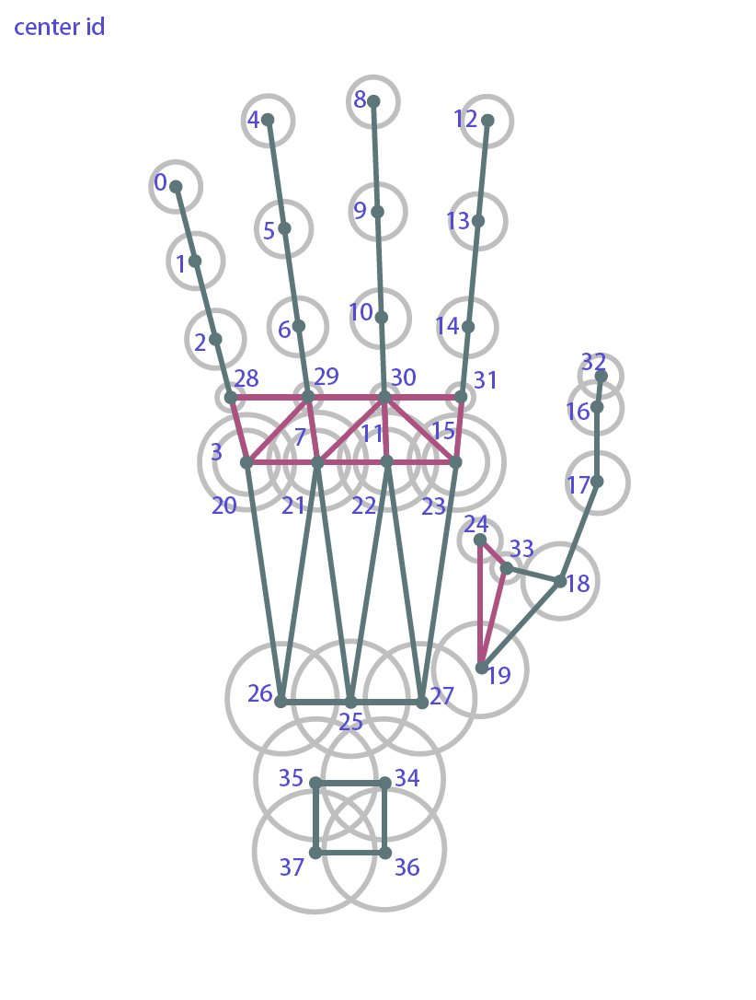

# SModel
A Sphere-Meshes based hunman body model with jointed hand

## Running Enviroment

- **Windows 10**
- Qt 5.13.1
- OpenGL 4.6
- GLM 0.9.9.6
- Eigen 3.3.7

### hardware

- Intel Core **i7-8700 @ 3.2GhZ**
- NVIDIA GeForce RTX 2070

## Getting Started

### Setup

Make sure you have setup the Qt.

in `CMakeLists.txt`

* `set (CMAKE_PREFIX_PATH ...)` to your Qt path and make sure you have already added the environment value
* modify the `main.cpp`, set the `project_path` to your project
* we have put the third party library in the folder **external**

### Display

* **press 0**: a dialog of making animation
* **press 1**: a dialog of tunning the body
* **press 2**: a dialog of tunning the right hand
* **press 3**: a dialog of tunning the left hand
* **RB**: rotation
* **Scroll**: translation
* **alt+ LB**: focus on the (0, 0, 0)
* **alt + RB**: zoom in or out
* **alt + Scroll**: translation

### Running Result

## Model Introduction

### body

The body's structure is similar to the OpenPose, we add 13-20 centers to simulate the arm.

### hands

This hand model is the same as [HModel](https://github.com/OpenGP/hmodel). Actually our work is based on their work.
